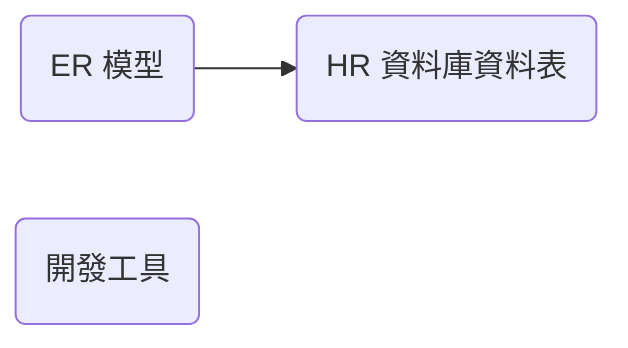

@import "../css/article_01.css"


# U01 - 實體關係（ER）模型與資料表結構

## 概念



## 練習 1


參考附上的 ER 圖，回答下列問題：
1. `Locations` 和 `Departments` 兩個實體之間的數量關係為何？
2. `Departments` 和 `Employees` 兩個實體之間的數量關係為何？
3. `Employees` 與自身之間的數量關係為何？
4. 若要取得員工部門所在區域的名稱（`region_name`），需要串接（join）哪些資料表？

## 活動 2

1. 使用 SQL Developer 連線
2. 執行以下查詢敘述：
```
select * from employees;
```

SQLcl 
```
sql hr@<db_host>/pdb1
```

