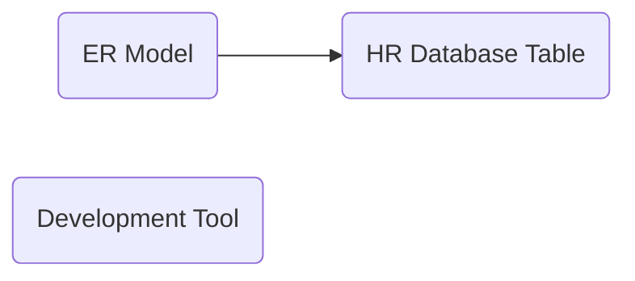
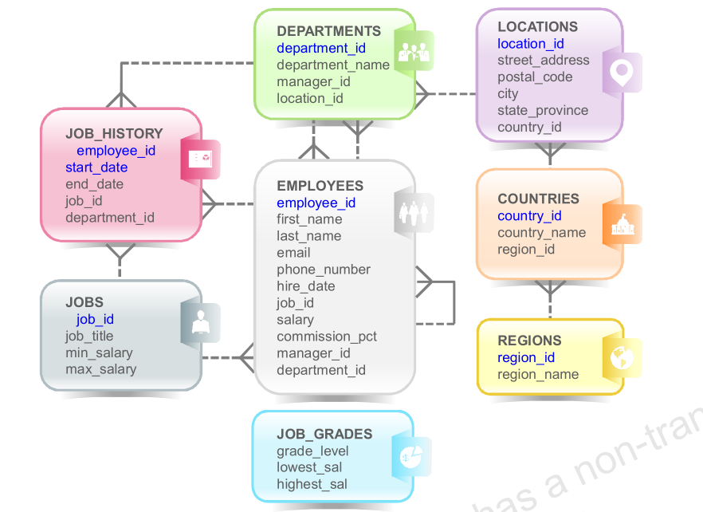

@import "../css/article_01.css"


# U01 - Entity Relationship (ER) Model and Table Structure

## Concepts



## 練習 1



參考所附之 ER Diagram, 回答以下的問題
1. Locations 和 Departments 兩個 Entity 之間的數量關係?
2. Departments 與  Employees 兩個 Entity 之間的數量關係?
3. Employees 和自己間的的數量關係?
4. 要取得員工部間所在的區域名稱(region_name), 需要串接(join)那幾張表格

## Activity 2

1. 使用 SQLDeveloper 連線
2. 執行以下的 Query Statement 
```
select * from employees;
```

SQLcl 
```
sql hr@<db_host>/pdb1
```

