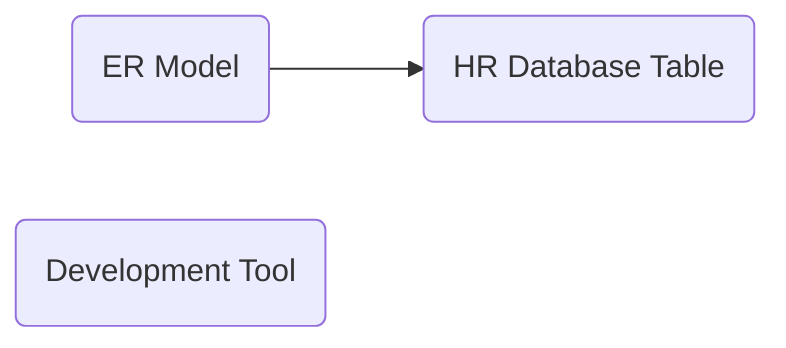

@import "../css/article_01.css"


# U01 - Entity Relationship (ER) Model and Table Structure

## Concepts



## Practice 1


Refer to the attached ER diagram and answer the following questions.
1. What is the cardinality relationship between the Locations and Departments entities?
2. What is the cardinality relationship between the Departments and Employees entities?
3. What is the cardinality relationship between Employees and itself (self-relationship)?
4. To obtain the region name (`region_name`) of an employee's department location, which tables need to be joined?

## Activity 2

1. Connect using SQL Developer.
2. Execute the following query statement. 
```
select * from employees;
```

SQLcl 
```
sql hr@<db_host>/pdb1
```

