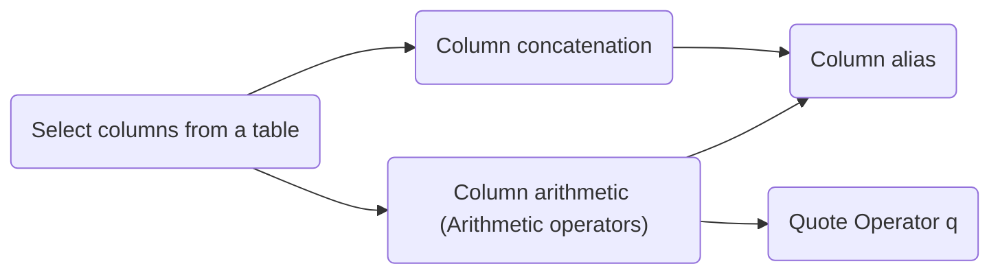

@import "../css/article_01.css"

# U02 - Retrieving Data Using the SQL SELECT Statement

## Concept Map

## Practice
### P1

The HR department wants a query to display the last name, job ID, hire date, and employee ID for each employee, with the employee ID appearing first. 

Provide an alias `STARTDATE` for the `HIRE_DATE` column. 

### P2 

The HR department wants a query to display all unique job IDs from the `EMPLOYEES` table.

### P3

The HR department wants more descriptive column headings for its report on employees.

Based on the query in the P1, name the report columns to `Emp #`, `Employee`, `Job`, and `Hire Date`, respectively.

### P4 
The HR department has requested a report of all employees and their job IDs. 
Display the last name concatenated with the job ID (separated by a comma and space) and name the column `Employee` and `Title`.

### P5 

The HR department wants to display each employee's manager employee ID. Use the following display format:

` [Employee_id] [Last_name]'s manager_id is [manager_id] `

Items in brackets are column names. Name this column `Employee's Manager ID List`.

