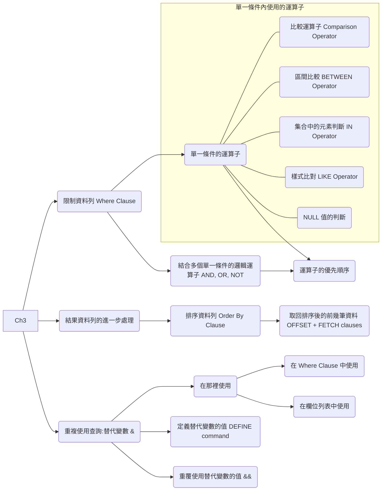

# U03 篩選與排序資料

## 概念

## 練習

### P1

由於預算考量，人力資源部門需要一份報表，顯示薪水高於 `$12,000` 的員工姓氏與薪資。請依薪資排序資料列。

### P2

建立一份報表，顯示員工編號 176 的姓氏與部門編號。

### P3 
人力資源部門需要找出高薪與低薪員工。請建立一份報表，顯示薪水**不在** `$5,000` 到 `$12,000` 區間內之員工的姓氏與薪資。

### P4

建立一份報表，顯示姓氏為 Matos 與 Taylor 的員工之姓氏、職務代碼與到職日。請依到職日遞增排序。

### P5

顯示所有位於部門 20 或部門 50 的員工姓氏與部門編號，並依 `last_name` 字母順序遞增排序。

### P6

建立一份報表，顯示薪水介於 `$5,000` 到 `$12,000` 且位於部門 20 或部門 50 的員工姓氏與薪資。請將欄位名稱分別標示為 `Employee` 與 `Monthly Salary`。

### P7

人力資源部門需要一份報表，顯示所有於 2010 年到職之員工的姓氏與到職日。

### P8

建立一份報表，顯示所有沒有經理的員工之姓氏與職稱。

### P9

建立一份報表，顯示所有有領取佣金之員工的姓氏、薪資與佣金。

請依薪資與佣金遞減排序資料。

在 `ORDER BY` 子句中請使用欄位的**位置編號**。

### P10

HR 部門成員希望查詢能更有彈性。他們想要一份報表，顯示薪資高於使用者提示輸入金額之員工的姓氏與薪資。

例如，若提示輸入 `12000`，報表應顯示如下結果：

### P11

人力資源部門希望能依據經理來產生報表。

請建立一個查詢，提示使用者輸入經理編號與排序欄位名稱。查詢需列出該經理所管理員工的員工編號、姓氏、薪資與部門，並依指定欄位排序。

<!-- The HR department wants the ability to sort the report on a selected column.  -->

可以用下列測試資料驗證：
- manager_id = 103, sorted by `last_name`
- manager_id = 201, sorted by `salary`
- manager_id = 124, sorted by `employee_id`

### P12

顯示所有姓氏第三個字母為 `a` 的員工姓氏。

### P13

顯示所有姓氏中同時包含 `a` 與 `e` 的員工姓氏。

### P14

顯示所有職務為業務代表或倉儲管理員，且薪資不等於 `$2,500`、`$3,500` 或 `$7,000` 的員工之姓氏、職務與薪資。

### P15

建立一份報表，顯示所有佣金比例為 20% 之員工的姓氏、薪資與佣金。

