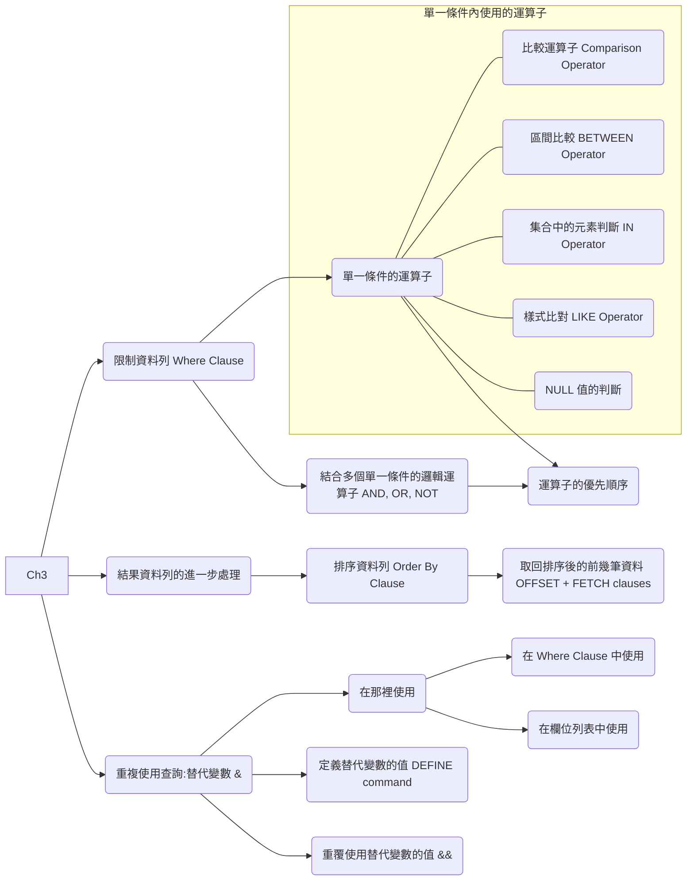
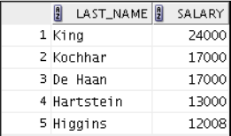
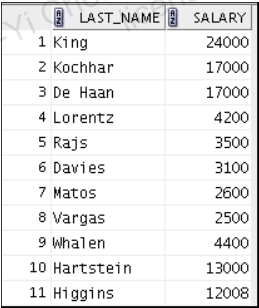
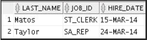
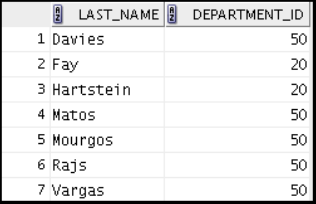
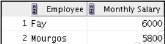
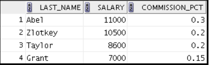
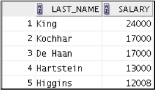
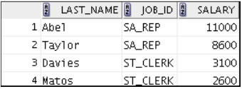

# U03 Restricting and Sorting Data

## Concepts

## 練習

### P1

Because of budget issues, the HR department needs a report that displays the last name and salary of employees who earn more than `$12,000`. Sort rows according to the the salary.

### P2

Create a report that displays the last name and department
number for employee number 176.

### P3 
The HR department needs to find high-salaried and low-salaried employees. Create a report to display the last name and salary for any employee whose salary **is not** in the range `$5,000` through `$12,000`. 

### P4

Create a report to display the last name, job ID, and hire date for employees with the last names of Matos and Taylor. Order the query in ascending order by hire date.

### P5

Display the last name and department ID of all employees in department 20 or department 50 in ascending alphabetical order by last_name.

### P6

Create a report to display the last name and salary of employees who earn between `$5,000` and `$12,000`, and are in department 20 or department 50. Label the columns Employee and Monthly Salary, respectively.

### P7

The HR department needs a report that displays the last name and hire date of all employees who were hired in 2010.

### P8

Create a report to display the last name and job title of all employees who do not have a manager.

### P9

Create a report to display the last name, salary, and commission of all employees who earn commissions. 

Sort the data in descending order of salary and commissions.

Use the column’s **numeric position** in the ORDER BY clause.

### P10

Members of the HR department want to have more flexibility with the queries that you are writing. They would like a report that displays the last name and salary of employees who
earn more than an amount that the user specifies after a prompt. 

For example, If you enter 12000 when prompted, the report displays the following results:

### P11

The HR department wants to run reports based on a manager. 

Create a query that prompts the user for a manager ID and the column name for sorting. The query generates the employee ID, last name, salary, and department for that manager’s employees and sorts returned rows according to the given column name.  

<!-- The HR department wants the ability to sort the report on a selected column.  -->

You can test the data with the following values:
- manager_id = 103, sorted by `last_name`
- manager_id = 201, sorted by `salary`
- manager_id = 124, sorted by `employee_id`

### P12

Display the last names of all employees where the third letter of the name is “a.”

### P13

Display the last names of all employees who have both an “a” and an “e” in their last name.

### P14

Display the last name, job, and salary for all employees whose jobs are either that of a sales representative or a stock clerk, and whose salaries are not equal to `$2,500`, `$3,500`, or `$7,000`.

### P15

Create a report to display the last name, salary, and commission for all employees whose commission is 20%.

