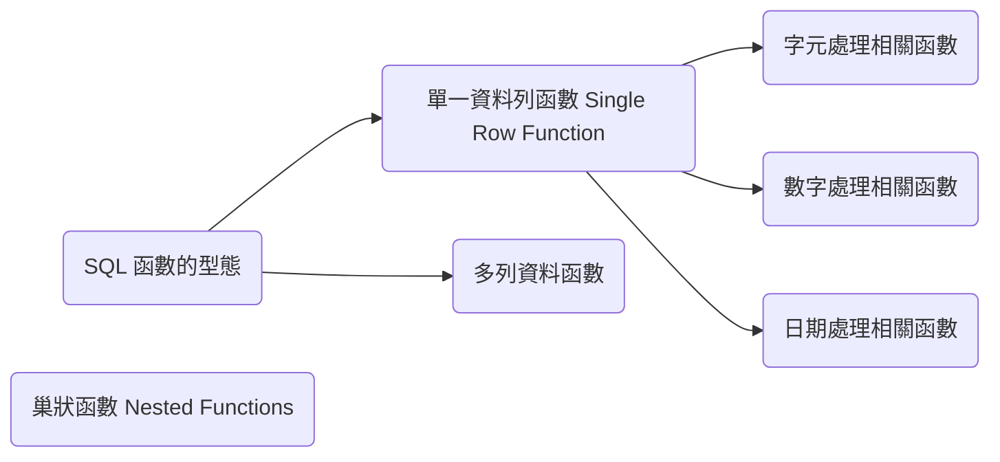

---
puppeteer:
   displayHeaderFooter: true
html: 
    embed_local_images: true
    embed_svg: true
export_on_save:
    html: true
---


# U04 Using Single Row Functions To Customize Report

## Concepts



## Practices

### P1

Write a query to display the system date. Label the column Date.


### P2

The HR department needs a report to display the employee number, last name, salary, and salary increased by 15.5% (expressed as a whole number (整數) ) for each employee. Label the column New Salary. 


### P3

Modify your query in P2 to add a column that subtracts the old salary from
the new salary. Label the column `Increase`. 


### P4

Write a query that displays the last name (with the first letter in uppercase and all the other letters in lowercase) and the length of the last name for all employees whose name starts with the letters “A,” or “M.” Give each column an appropriate label. Sort the results by the employees’ last names.


### P5
Rewrite the query so that the user is prompted to enter the letter that the last name starts with.

The case of the letter that is entered should not affect the outputs. 


### P6

The HR department wants to find the duration of employment for each employee. For each employee, display the last name and calculate the number of months between today and the date on which the employee was hired. Label the column as `MONTHS_WORKED`. 

Order your results by the number of months employed. The number of months must be rounded to the closest whole number.

### P7

Create a query that displays the employees’ last names, and indicates the amounts of their salaries with asterisks. Each asterisk signifies a thousand dollars. Sort the data in descending order of salary. Label the column SALARIES_IN_ASTERISK.

### P8

Create a query to display the last name and the number of weeks employed for all employees in department 90. Label the number of weeks column as `TENURE`. Truncate the number of weeks value to 0 decimal places. Show the records in descending order of the employee’s tenure.


### P9

Create a table and insert data to it by using the following codes:
```sql
create table WS1U04P8 (cust_name varchar2(40));
INSERT into ws1u04p8 values ('Renske Ladwig');
INSERT into ws1u04p8 values ('Jason Mallin');
INSERT into ws1u04p8 values ('Samuel McCain');
INSERT into ws1u04p8 values ('Allan MCEwen');
INSERT into ws1u04p8 values ('Irene Mikilineni');
INSERT into ws1u04p8 values ('Julia Nayer');
commit;
```

You need to display customers’ second names where the second name starts with “Mc” or “MC”. Write the query to gives the required output?


