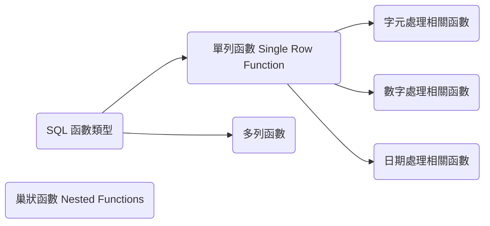
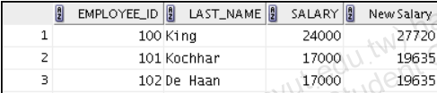
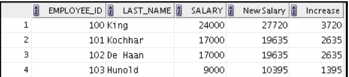
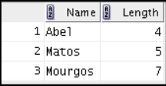
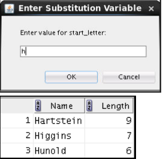
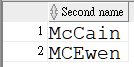

---
puppeteer:
   displayHeaderFooter: true
html: 
    embed_local_images: true
    embed_svg: true
export_on_save:
    html: true
---


# U04 使用單列函數自訂報表

## 概念



## 練習

### P1

撰寫查詢以顯示系統日期，並將欄位命名為 `Date`。


### P2

人力資源部門需要一份報表，顯示每位員工的員工編號、姓氏、薪資，以及調薪 15.5% 後的薪資（以整數表示）。請將該欄位命名為 `New Salary`。



### P3

修改 P2 的查詢，新增一個欄位，以新薪資減去舊薪資。請將此欄位命名為 `Increase`。




### P4

撰寫查詢，顯示所有姓氏以 `A` 或 `M` 開頭之員工的姓氏（第一個字母大寫，其餘字母小寫）與姓氏長度。請為各欄位設定適當名稱，並依員工姓氏排序結果。




### P5
改寫前一題查詢，讓使用者可輸入姓氏開頭字母。

輸入字母的大小寫不應影響查詢結果。




### P6

人力資源部門想了解每位員工的任職期間。請針對每位員工顯示姓氏，並計算從到職日到今天的月數，欄位命名為 `MONTHS_WORKED`。

請依任職月數排序，且月數需四捨五入為最接近的整數。

### P7

建立查詢，顯示員工姓氏，並以星號表示薪資金額。每個星號代表一千美元。請依薪資遞減排序，並將欄位命名為 `SALARIES_IN_ASTERISK`。

### P8

建立查詢，顯示部門 90 所有員工的姓氏與任職週數。請將週數欄位命名為 `TENURE`，並將其截斷至 0 位小數，再依任職週數遞減排序。


### P9

請使用下列程式碼建立資料表並插入資料：
```sql
create table WS1U04P8 (cust_name varchar2(40));
INSERT into ws1u04p8 values ('Renske Ladwig');
INSERT into ws1u04p8 values ('Jason Mallin');
INSERT into ws1u04p8 values ('Samuel McCain');
INSERT into ws1u04p8 values ('Allan MCEwen');
INSERT into ws1u04p8 values ('Irene Mikilineni');
INSERT into ws1u04p8 values ('Julia Nayer');
commit;
```

請顯示姓氏以 `Mc` 或 `MC` 開頭的客戶姓名。請撰寫查詢以得到所需輸出。



