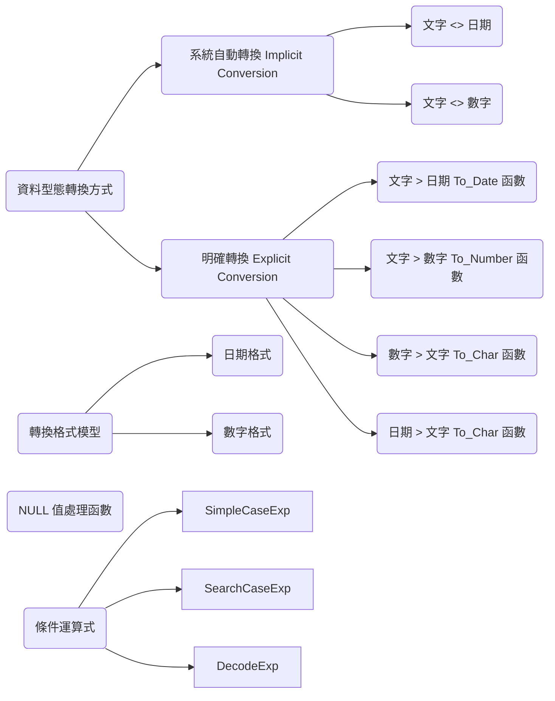

---
puppeteer:
   displayHeaderFooter: true
html: 
    embed_local_images: true
    embed_svg: true
export_on_save:
    html: true
---


# U05 使用轉換函數與條件運算式

## 概念



### 練習

### P1 
建立一份報表，對每位員工產生如下輸出：
```
[employee last name] earns [salary] monthly but wants [3 times salary.]. 
```
請將欄位命名為 `Dream Salaries`。

注意：兩個薪資欄位中的數字都必須套用格式化顯示。


### P2

顯示每位員工的姓氏、到職日，以及薪資審查日。薪資審查日為到職滿六個月後的第一個星期一。請將該欄位命名為 `REVIEW`。

日期格式需呈現為類似 `Monday, the Thirty-First of July, 2000.` 的樣式。


### P3

建立查詢，顯示員工的姓氏與佣金金額。若員工沒有佣金，則顯示 `No Commission.`。請將欄位命名為 `COMM`。


### P4

請使用 `CASE` 函數，根據 `JOB_ID` 欄位的值顯示所有員工的等級，對應規則如下：


### P5

請改用 searched `CASE` 語法重寫上一題的敘述。

### P6

請改用 `DECODE` 語法重寫上一題的敘述。


### P7

撰寫查詢，顯示下個月第一個星期一的日期。輸出格式如下：

```
05 is the first Monday for April 2021
```

### P8
 
請檢視 `PROGRAMS` 資料表結構：

欄位名稱 | 可為空值？ | 型態
--|--|--
PROG_ID | NOT NULL | NUMBER(3)
PROG_COST | | NUMBER(8,2)
START_DATE | NOT NULL | DATE
END_DATE | | DATE

哪兩個 SQL 敘述可以成功執行？
A. SELECT NVL (ADD_MONTHS (END_DATE,1), SYSDATE) FROM programs;
B. SELECT TO_DATE(NVL(SYSDATE-END_DATE, SYSDATE)) FROM programs;
C. SELECT NVL (MONTHS_BETWEEN (start_date, end_date), 'Ongoing') FROM programs;
D. SELECT NVL (TO_CHAR(MONTHS_BETWEEN (start-date, end_date)), 'Ongoing') FROM programs

請說明錯誤選項的原因。


