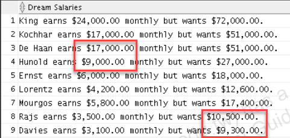
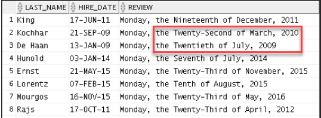
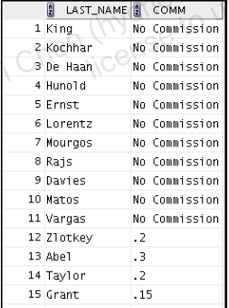
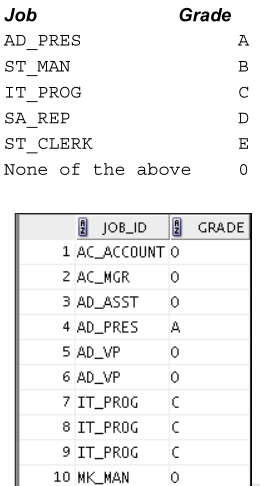

---
puppeteer:
   displayHeaderFooter: true
html: 
    embed_local_images: true
    embed_svg: true
export_on_save:
    html: true
---


# U05 Using conversion function and conditional expression

## Concepts

```mermaid
graph LR;
ConvTypes(Type conversion methods)-->ImplicitConv(System implicit conversion)
ConvTypes-->ExplicitConv(Explicit conversion)

ImplicitConv-->CharDateChar(Character <> Date)
ImplicitConv-->CharNumChar(Character <> Number)

ExplicitConv-->Char2Date(Character -> Date (TO_DATE function))
ExplicitConv-->Char2Num(Character -> Number (TO_NUMBER function))
ExplicitConv-->Num2Char(Number -> Character (TO_CHAR function))
ExplicitConv-->Num2Date(Date -> Character (TO_CHAR function))

FormatModel(Format models)-->DateFmtModel(Date format)
FormatModel(Format models)-->NumFmtModel(Number format)

NullValFun(NULL-handling functions)

CondExp(Conditional expressions)
CondExp-->SimpleCaseExp
CondExp-->SearchCaseExp
CondExp-->DecodeExp
```

### Practices

### P1 
Create a report that produces the following output for each employee:
```
[employee last name] earns [salary] monthly but wants [3 times salary.]. 
```
Label the column `Dream Salaries`.

Note that the numbers to show the two salary fields are formatted .



### P2

Display each employee’s last name, hire date, and salary review date, which is the first Monday after six months of service. Label the column `REVIEW`. 

Format the dates to appear in a format that is similar to “Monday, the Thirty-First of July, 2000.”



### P3

Create a query that displays employees’ last names and commission amounts. If an employee does not earn commission, show “No Commission.” Label the column `COMM`.



### P4

Using the CASE function, write a query that displays the grade of all employees based on the value of the `JOB_ID` column, using the following data:



### P5

Rewrite the statement in the preceding exercise by using the searched `CASE` syntax.

### P6

Rewrite the statement in the preceding exercise by using the `DECODE` syntax.


### P7

Write a query to display the date for the first Monday of the next month. Show the output like the following:

```
05 is the first Monday for April 2021
```

### P8
 
Examine the structure of the PROGRAMS table:

Name | Null? | Type
--|--|--
PROG_ID | NOT NULL | NUMBER(3)
PROG_COST | | NUMBER(8,2)
START_DATE | NOT NULL | DATE
END_DATE | | DATE

Which two SQL statements would execute successfully?
A. SELECT NVL (ADD_MONTHS (END_DATE,1), SYSDATE) FROM programs;
B. SELECT TO_DATE(NVL(SYSDATE-END_DATE, SYSDATE)) FROM programs;
C. SELECT NVL (MONTHS_BETWEEN (start_date, end_date), 'Ongoing') FROM programs;
D. SELECT NVL (TO_CHAR(MONTHS_BETWEEN (start-date, end_date)), 'Ongoing') FROM programs

Please provide the reasons for the wrong options.


