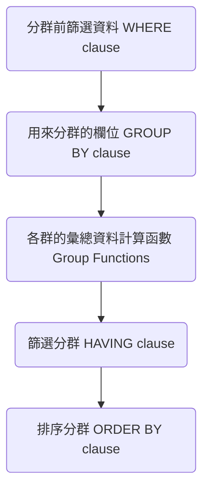
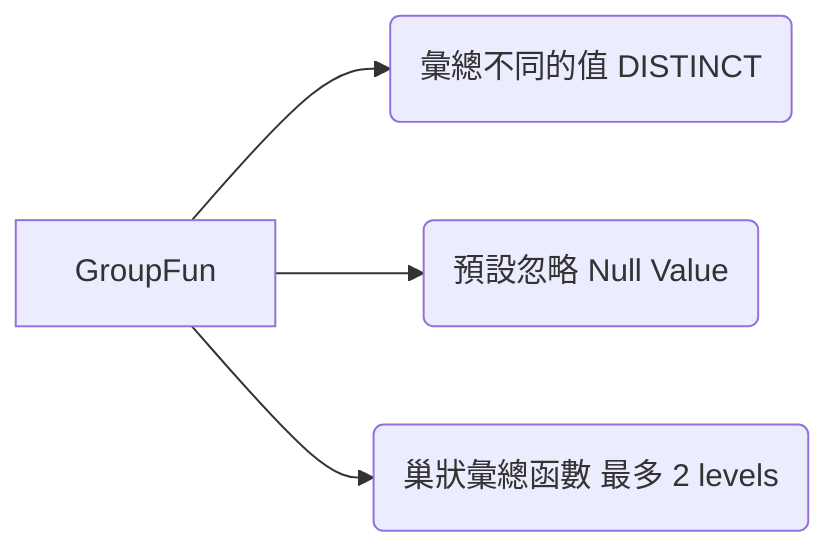

---
puppeteer:
   displayHeaderFooter: true
html: 
    embed_local_images: true
    embed_svg: true
export_on_save:
    html: true
---

# U06 Reporting Aggregated Data Using the Group Functions

資料列分群並計算分群後的彙總資料

Group Functions

## 練習

### Q1

Write a query to display the minimum, maximum, sum, and average salary for each job type. Round your results to the nearest whole number.

### Q2 

Write a query to display the number of people with the same job. 

Generalize the query so that a user in the HR department is prompted for a job title.

For example, when the user enters `IT_PROG`, he gets the following report:

### Q3

Determine the number of distinct managers in the company. Use the `manager_id` column in the `employees` table to determine.

### Q4

Create a report to display the manager id and the salary of the lowest-paid employee for that manager. Exclude anyone whose manager is not known. Exclude any groups where the minimum salary is $6,000 or less. Sort the output in descending order of salary.

### Q5

Create a query that displays the total number of employees and, of that total, the number of employees hired in 2009, 2010, 2011, and 2012. Create appropriate column headings.

