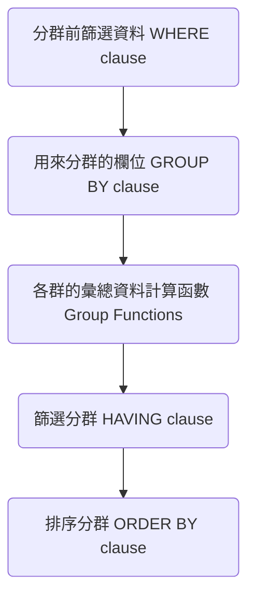
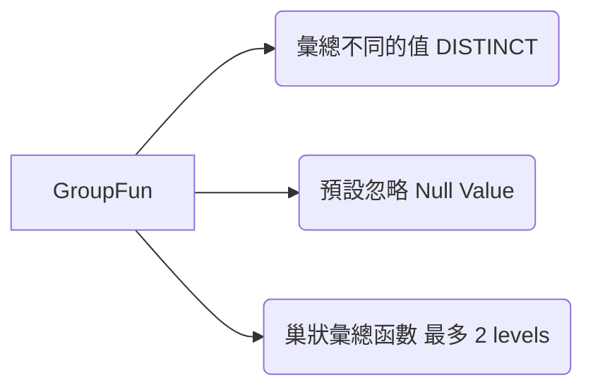
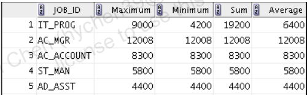
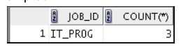
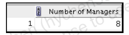
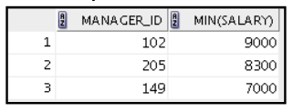
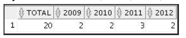

---
puppeteer:
   displayHeaderFooter: true
html: 
    embed_local_images: true
    embed_svg: true
export_on_save:
    html: true
---

# U06 使用群組函數製作彙總報表

將資料列分群後，計算各群的彙總資料。

Group Functions

## 練習

### Q1

撰寫查詢，顯示各職務類型的最低薪資、最高薪資、總薪資與平均薪資。結果請四捨五入到最接近的整數。

### Q2 

撰寫查詢，顯示每種職務的人數。

請將查詢泛化，讓 HR 使用者可輸入職務代碼作為查詢條件。

例如，當使用者輸入 `IT_PROG` 時，應得到如下報表：

### Q3

請利用 `employees` 資料表中的 `manager_id` 欄位，計算公司內不同經理的人數。

### Q4

建立一份報表，顯示各經理的編號，以及其所管理員工中最低薪者的薪資。不需列出經理未知的員工；另外，最低薪資為 `$6,000` 或以下的群組也要排除。請依薪資遞減排序。

### Q5

建立查詢，顯示員工總數，以及其中於 2009、2010、2011 與 2012 年到職的員工人數。請設定適當的欄位名稱。

