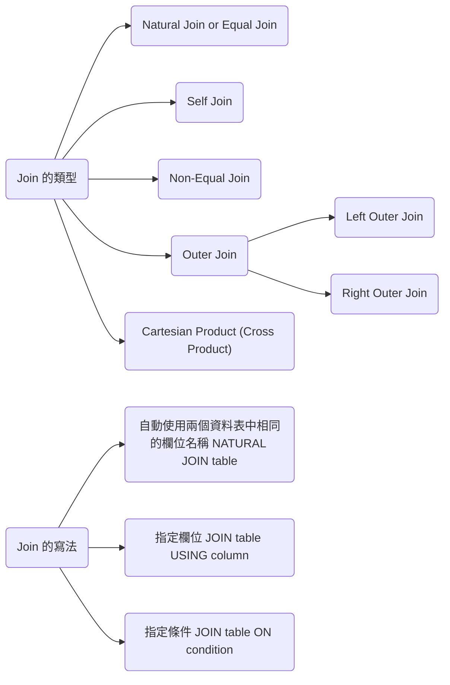

---
puppeteer:
   displayHeaderFooter: true
html: 
    embed_local_images: true
    embed_svg: true
export_on_save:
    html: true
---


# U07 使用 Join 從多個資料表顯示資料




## 題目

### Q1
請為 HR 部門撰寫查詢，以列出所有部門所在地的地址。請使用 `LOCATIONS` 與 `COUNTRIES` 資料表。

輸出需包含 location ID、街道地址、城市、州或省，以及國家。請使用 `NATURAL JOIN` 完成查詢。


### Q2

HR 部門需要一份多倫多員工報表。請顯示所有在 Toronto 工作員工的姓氏、職務、部門編號與部門名稱。


### Q3

HR 部門需要一份職等與薪資報表。請建立查詢，顯示所有員工的姓名、職務、部門名稱、薪資與職等。請先使用下列程式建立 `JOB_GRADES` 資料表。

```sql
create table job_grades (grade_level varchar2(1), lowest_sal number, highest_sal NUMBER);

insert into job_grades values('A', 1000, 2999);
insert into job_grades values('B', 3000, 5999);
insert into job_grades values('C', 6000, 9999);
insert into job_grades values('D', 10000, 14999);
insert into job_grades values('E', 15000, 24999);
insert into job_grades values('F', 25000, 40000);
commit;
```

查詢輸出應類似如下：


### Q4 

建立一份報表，顯示員工的姓氏與員工編號，以及其經理的姓氏與經理編號。結果中必須包含沒有經理的員工。


### Q5

HR 部門希望找出所有在 Davies 之後到職的員工姓名。

請建立查詢，顯示所有於員工 Davies 之後到職之員工的姓名與到職日。


### Q6

HR 部門需要找出所有比其經理更早到職的員工姓名與到職日，並一併顯示其經理姓名與到職日。


