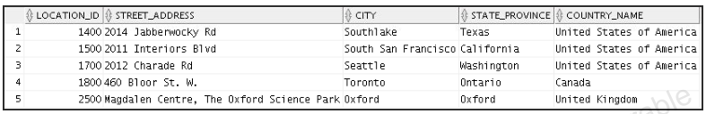
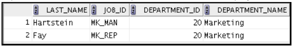
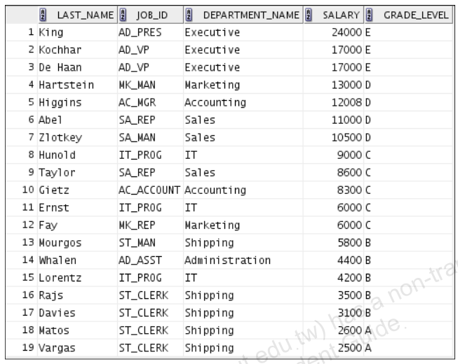
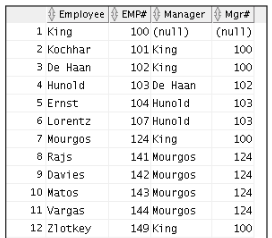
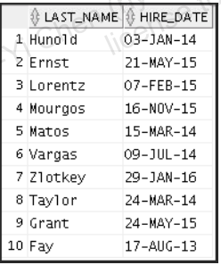
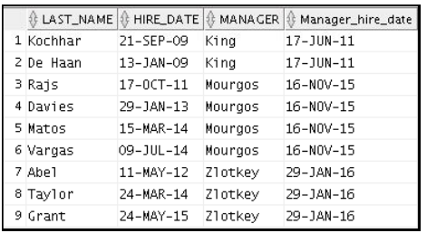

---
puppeteer:
   displayHeaderFooter: true
html: 
    embed_local_images: true
    embed_svg: true
export_on_save:
    html: true
---


# U07 Displaying Data from Multiple Tables Using Joins


```mermaid
graph LR;
  JoinType(Join forms)

  JoinType-->NaturalJoin(Natural Join or Equal Join)
  JoinType-->SelfJoin(Self Join)
  JoinType-->NonEqualJoin(Non-Equal Join)
  JoinType-->OuterJoin(Outer Join)
  JoinType-->CrossJoin("Cartesian Product (Cross Product)")
  OuterJoin-->LeftOuter(Left Outer Join)
  OuterJoin-->RightOuter(Right Outer Join)

  JoinMethod(Join methods)
  UseSameColName(Automatically use same-named columns from both tables (NATURAL JOIN))
  SpecifyColumn(Join by specified columns (JOIN ... USING))
  SpecifyCondition(Join by specified condition (JOIN ... ON))
  JoinMethod-->UseSameColName
  JoinMethod-->SpecifyColumn
  JoinMethod-->SpecifyCondition
```

## Exercises

### Q1
Write a query for the HR department to produce the addresses of all the departments. Use the `LOCATIONS` and `COUNTRIES` tables. 

Show the location ID, street address, city, state or province, and country in the output. Use a `NATURAL JOIN` to produce the results.




### Q2

The HR department needs a report of employees in Toronto. Display the last name, job, department number, and the department name for all employees who work in Toronto.



### Q3

The HR department needs a report on job grades and salaries. Create a query that displays the name, job, department name, salary, and grade for all employees. Use the following script to create the `JOB_GRADES` table.

```sql
create table job_grades (grade_level varchar2(1), lowest_sal number, highest_sal NUMBER);

insert into job_grades values('A', 1000, 2999);
insert into job_grades values('B', 3000, 5999);
insert into job_grades values('C', 6000, 9999);
insert into job_grades values('D', 10000, 14999);
insert into job_grades values('E', 15000, 24999);
insert into job_grades values('F', 25000, 40000);
commit;
```

The outputs of the query should look like the following:




### Q4 

Create a report to display employees’ last names and employee numbers along with their managers’ last names and manager numbers. The result should contain the employees who have no managers. 




### Q5

The HR department wants to determine the names of all employees who were hired after Davies. 

Create a query to display the name and hire date of any employee hired after employee Davies.



### Q6

The HR department needs to find the names and hire dates of all employees who were hired before their managers, along with their managers’ names and hire dates.




