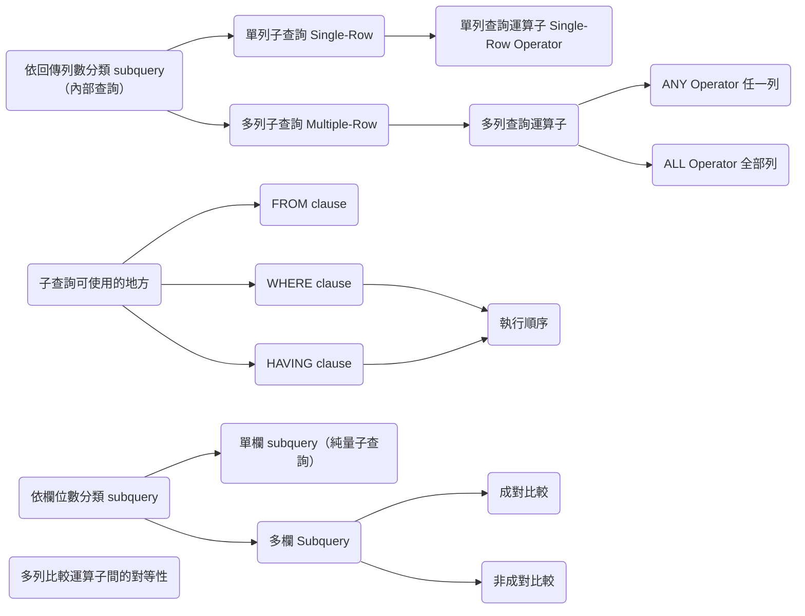
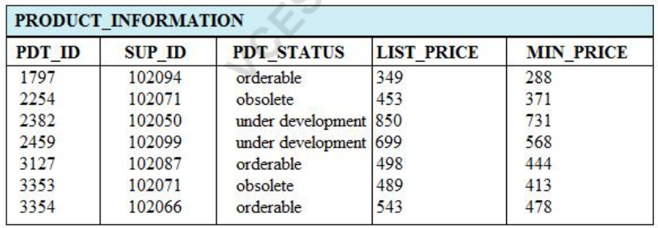

---
puppeteer:
   displayHeaderFooter: true
html: 
    embed_local_images: true
    embed_svg: true
export_on_save:
    html: true
---

# U08 使用子查詢解題

## 題目

### Q1

撰寫查詢，顯示所有薪資高於平均薪資，且與姓氏中包含字母 `u` 的任一員工位於同一部門之員工的員工編號（`EMPLOYEE_ID`）、姓氏（`LAST_NAME`）與薪資（`SALARY`）。

<!-- A-8, multiple-row operator, group function in subquery  -->

### Q2 

建立一份報表，列出所有薪資高於部門 60 任一員工薪資的員工。報表只需顯示員工姓氏（`LAST_NAME`）。

<!-- A7, multiple-row operator -->

### Q3

建立一份報表，顯示所有薪資高於平均薪資之員工的員工編號（`EMPLOYEE_ID`）、姓氏（`LAST_NAME`）與薪資（`SALARY`）。請依薪資遞增排序。

<!-- A2, group function in subquery -->

### Q4

關於多列子查詢，下列哪兩項敘述正確？（選兩項）

A. 可以包含群組函數。

B. 一定會包含巢狀子查詢。

C. 可以使用 `< ALL` 運算子來表示小於最大值。

D. 只能用來從單一資料表取回多列資料。

E. 如果子查詢結果可能包含 `NULL`，主查詢就不應搭配 `NOT IN` 運算子使用。

<!-- Q-89, 1z0-47 dump -->

錯誤選項請寫出原因。

### Q5 

關於子查詢，下列哪三項敘述正確？

A. 一個主查詢可以包含多個子查詢。

B. 一個子查詢可以對應多個主查詢。

C. 子查詢與主查詢必須從同一個資料表擷取資料。

D. 子查詢與主查詢可以從不同資料表擷取資料。

E. 子查詢與主查詢之間只能比較一個欄位或一個運算式。

F. 子查詢與主查詢之間可以比較多個欄位或多個運算式。

<!-- Q-41, 1z0-47 dump -->

錯誤選項請寫出原因。

### Q6

請查看附圖並檢視 `PRODUCT_INFORMATION` 資料表中的資料。

下列哪兩個工作需要用到子查詢？（選兩項）

A. 顯示所有最低定價高於 `status = orderable` 產品平均定價的產品

B. 顯示供應商 102071 所供應，且產品狀態為 `OBSOLETE` 的產品總數

C. 顯示定價高於平均定價的產品數量

D. 顯示平均定價高於 500 的所有供應商編號

E. 顯示各產品狀態的最低定價

除了選出正確選項外，還要寫出該選項所需的查詢。

### Q7

找出每個 location 下到職最早的員工（可能有多位），列出員工的 `employee_id`、`first_name`、`hire_date`、`department_id` 與 `location_id`。

<!-- Multiple-Row, Multiple-Column subquery -->

