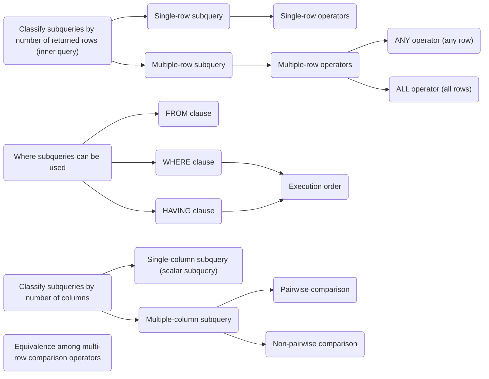

---
puppeteer:
   displayHeaderFooter: true
html: 
    embed_local_images: true
    embed_svg: true
export_on_save:
    html: true
---

# U08 Using Subqueries to Solve Queries

## Exercises

### Q1

Write a query to display the employee number (`EMPLOYEE_ID`), last name(`LAST_NAME`), and
salary(`SALARY`) of all employees who earn more than the average salary and who work in a department with any employee whose last name contains the letter "u."

<!-- A-8, multiple-row operator, group function in subquery  -->

### Q2 

Create a report that displays a list of all employees whose salary is more than the salary of any employee from department 60. The report contains only the last names (`LAST_NAME`) of the employees.

<!-- A7, multiple-row operator -->

### Q3

Create a report that displays the employee number (`EMPLOYEE_ID`), last name(`LAST_NAME`), and salary(`SALARY`) of all employees who earn more than the average salary. Sort the results in ascending order by salary.

<!-- A2, group function in subquery -->

### Q4

Which two statements are true regarding multiple-row subqueries? (Choose two.) 

A. They can contain group functions.

B. They always contain a subquery within a subquery.

C. They use the < ALL operator to imply less than the maximum.

D. They can be used to retrieve multiple rows from a single table only.

E. They should not be used with the NOT IN operator in the main query if NULL is likely to be a part of the result of the subquery.

<!-- Q-89, 1z0-47 dump -->

For each incorrect option, explain why it is incorrect.

### Q5 

Which three statements are true reading subquery?

A. A Main query can have many subqueries.

B. A subquery can have more than one main query.

C. The subquery and main query must retrieve date from the same table.

D. The subquery and main query can retrieve data from different tables.

E. Only one column or expression can be compared between the subquery and main query.

F. Multiple columns or expressions can be compared between the subquery and main query.

<!-- Q-41, 1z0-47 dump -->

For each incorrect option, explain why it is incorrect.

### Q6

View the Exhibit and examine the data in the PRODUCT_INFORMATION table. 

Which two tasks would require subqueries? (Choose two.)

A. displaying all the products whose minimum list prices are more than average list price of products having the status orderable

B. displaying the total number of products supplied by supplier 102071 and having product status OBSOLETE

C. displaying the number of products whose list prices are more than the average list price

D. displaying all supplier IDs whose average list price is more than 500

E. displaying the minimum list price for each product status

In addition to choosing the correct option, write the query required for that option.

### Q7

Find the most senior employee(s) in each location (there may be more than one), and list employee_id, first_name, hire_date, department_id, and location_id.

<!-- Multiple-Row, Multiple-Column subquery -->

