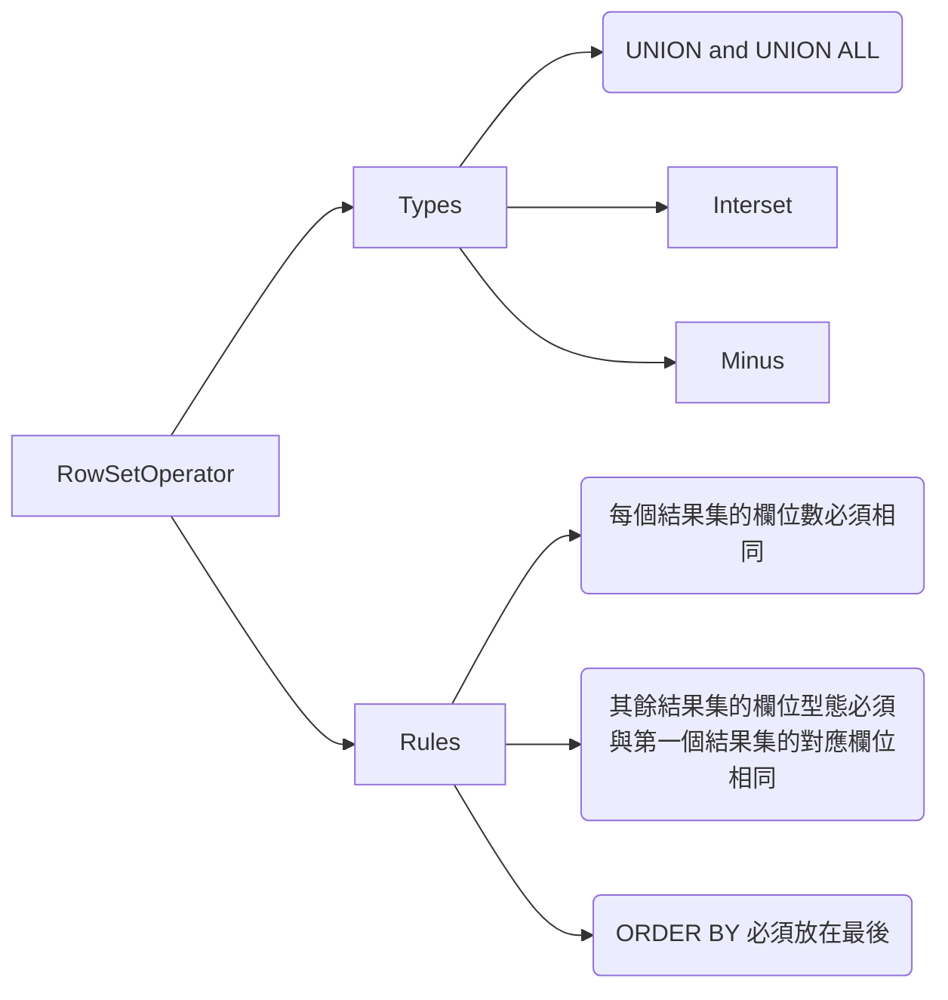

---
puppeteer:
   displayHeaderFooter: true
html: 
    embed_local_images: true
    embed_svg: true
export_on_save:
    html: true
---

# U09 使用集合運算子

## 概念複習



## 題目

### Q1

HR 部門需要一份部門編號清單，列出所有未包含職務代碼 `ST_CLERK` 的部門。請使用集合運算子完成此報表。


### Q2 

HR 部門需要一份符合下列規格的報表：
- 來自 `EMPLOYEES` 資料表的所有員工姓氏與部門編號，不論該員工是否隸屬某個部門。
- 來自 `DEPARTMENTS` 資料表的所有部門編號與部門名稱，不論該部門是否有員工。

請撰寫複合查詢完成此報表。


### Q3 

建立一份報表，列出所有職務為業務代表（`SA_REP`），且目前在業務部門（ID=`80`）工作的員工。

報表中請顯示這些員工的 `employee_id`。
請使用集合運算子完成此報表。

### Q4 

HR 部門需要一份沒有任何部門設立於其中的國家清單。請顯示國家代碼（`country_id`）與國家名稱（`country_name`），並使用集合運算子完成此報表。

### Q5
<!-- Q62  -->
請查看附圖並檢視 `EMPLOYEES` 資料表結構。


請判斷下列 SQL 敘述：
```sql
SELECT employee_id, department_id
FROM employees
WHERE department_id= 50 
ORDER BY department_id
UNION
SELECT employee_id, department_id
FROM employees
WHERE department_id=90
UNION
SELECT employee_id, department_id
FROM employees
WHERE department_id=10;
```

上述 SQL 敘述的執行結果會是什麼？
A. 敘述無法執行，因為 `ORDER BY` 子句應使用欄位位置編號，而不是欄位名稱。

B. 敘述可成功執行，並依 `DEPARTMENT_ID` 遞增顯示所有資料列。

C. 敘述可成功執行，但會忽略 `ORDER BY` 子句，並以隨機順序顯示資料列。

D. 敘述無法執行，因為 `ORDER BY` 子句只能出現在整個 SQL 敘述的最後，也就是最後一個 `SELECT` 之後。

請說明原因。


### Q6

<!-- ## No.122 Characteristics of the UNION operator -->

關於 `UNION` 運算子，下列哪一項敘述正確？

A. 預設情況下，輸出結果不會排序。
B. 在檢查重複資料時，不會忽略 `NULL` 值。
C. 所有 `SELECT` 敘述中的欄位名稱都必須完全相同。
D. 所有 `SELECT` 敘述選出的欄位數不必相同。

請說明錯誤選項的原因。

### Q7

<!-- ## No.137 Characteristics of the INTERSECT operator -->

關於 `INTERSECT` 運算子，下列哪一項敘述正確？

A. 所有 `SELECT` 敘述中的欄位名稱都必須完全相同。
B. 它會忽略 `NULL` 值。
C. 將參與交集運算的資料表順序對調，會改變結果。
D. 查詢中所有 `SELECT` 敘述的欄位數與資料型態都必須一致。

請說明錯誤選項的原因。

