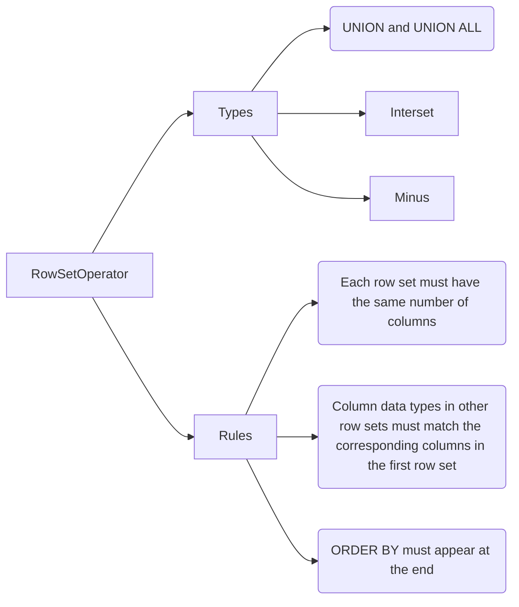
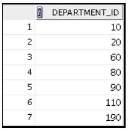
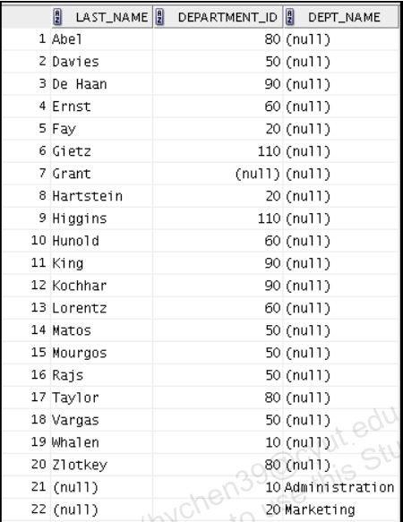
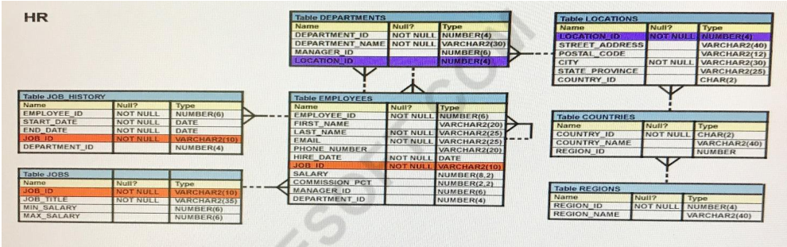

---
puppeteer:
   displayHeaderFooter: true
html: 
    embed_local_images: true
    embed_svg: true
export_on_save:
    html: true
---

# U09 Using set operators

## Concepts Review 



## Exercises

### Q1

The HR department needs a list of department IDs for departments that do not contain the
job ID `ST_CLERK`. Use the set operators to create this report.




### Q2 

The HR department needs a report with the following specifications:
- Last names and department IDs of all employees from the EMPLOYEES table,
regardless of whether or not they belong to a department.
- Department IDs and department names of all departments from the DEPARTMENTS
table, regardless of whether or not they have employees working in them.

Write a compound query to accomplish this report.




### Q3 

Create a report that lists the all employees who are sales representatives (`SA_REP`) and are
currently working in the sales department (ID=80). 

Show the `employee_id` of these employees in the report.
Please use the set operations to make the report.

### Q4 

The HR department needs a list of countries that have no departments located in them. Display the country IDs (`country_id`) and the names of the countries (`country_name`). Use the set operators to create this report.

### Q5
<!-- Q62  -->
View the Exhibit and examine the structure in the EMPLOYEES tables.




Evaluate the following SQL statement:
```sql
SELECT employee_id, department_id
FROM employees
WHERE department_id= 50 
ORDER BY department_id
UNION
SELECT employee_id, department_id
FROM employees
WHERE department_id=90
UNION
SELECT employee_id, department_id
FROM employees
WHERE department_id=10;
```

What would be the outcome of the above SQL statement?
A. The statement would not execute because the positional notation instead of the column name should be used with the ORDER BY clause.

B. The statement would execute successfully and display all the rows in the ascending order of DEPARTMENT_ID.

C. The statement would execute successfully but it will ignore the ORDER BY clause and display the rows in random order.

D. The statement would not execute because the ORDER BY clause should appear only at the end of the SQL statement, that is, in the last SELECT statement.

Explain the reason.


### Q6

<!-- ## No.122 Characteristics of the UNION operator -->

Which statement is true regarding the UNION operator?

A. By default, the output is not sorted.
B. Null values are not ignored during duplicate checking.
C. Names of all columns must be identical across all select statements.
D. The number of columns selected in all select statements need not be the same.

Explain why the incorrect options are wrong.

### Q7

<!-- ## No.137 Characteristics of the INTERSECT operator -->

Which statement is true regarding the INTERSECT operator?

A. The names of columns in all SELECT statements must be identical.
B. It ignores NULL values.
C. Reversing the order of the intersected tables alters the result.
D. The number of columns and data types must be identical for all SELECT statements in the query.

Explain why the incorrect options are wrong.

