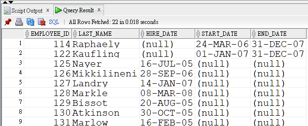

---
puppeteer:
   displayHeaderFooter: true
html: 
    embed_local_images: true
    embed_svg: true
export_on_save:
    html: true
---

# U09 Using set operators 課堂練習

## Q1

找出員工, 他們曾經在公司內擔任過 `ST_CLERK`, 的職位. 顯示的欄位包括:
employee_id, last_name, hire_date, start_date, 及 end_date.

結果請依 employee_id 排序.

員工的現職在 `employees` 表格中. 
員工的職位歷史資料可在 `job_history` 表格中找到.

參考輸出如下:




### Solution

```sql
select employee_id, last_name, hire_date, to_date(null) start_date, to_date(null) end_date
from employees
where job_id = 'ST_CLERK'
UNION
select employee_id, last_name, to_date(null), start_date, end_date
from job_history j join employees e USING (employee_id)
where j.job_id = 'ST_CLERK' /*注意 column ambiguity 的問題*/
order by 1;
```