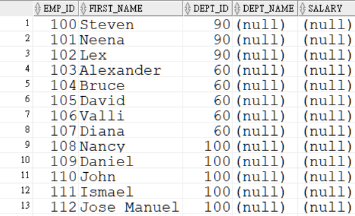
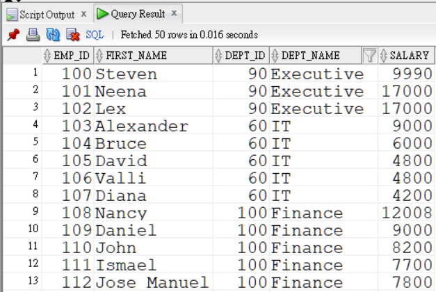

---
puppeteer:
   displayHeaderFooter: true
html: 
    embed_local_images: true
    embed_svg: true
export_on_save:
    html: true
---


# U10 使用 DML 敘述管理資料表

## 題目

### Q1

請執行以下 SQL 建立所需資料表：

```sql {class=line-numbers}
create table my_employee (
    emp_id number, 
    first_name varchar2(100), 
    dept_id number, 
    dept_name varchar2(100), 
    salary number);
```

將 `employees` 資料表中員工編號小於 200 的資料複製到 `my_employee` 資料表。
需要複製的欄位包括：
- `emp_id`: employee_id
- `first_name`: first_name
- `dept_id`: department_id

執行後的部分結果如下：



完成後請 `commit` 確認交易。

### Q2

請更新 Q1 建立之資料表中的紀錄，找出每位員工的部門名稱及薪資，填入 `dept_name` 與 `salary` 欄位。完成後請 `commit` 確認交易。

更新後的部分資料表如下：




