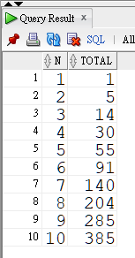
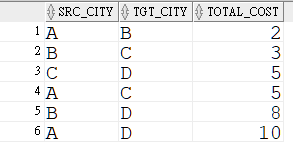

---
puppeteer:
   displayHeaderFooter: true
html: 
    embed_local_images: true
    embed_svg: true
export_on_save:
    html: true
---

#  WS2-L6 Retrieving Data using suqueries
- 主題: Recursive queries
## 題目

### Q1

使用 Recursive query, 計算以下算式的總合:

$ 1 + 2^2 + 3^2 + ... + 10^2 $ 

產生的報表如下:



### Q2

有以下城市間的運送成本, 城市間可以透過轉運, 送到其它目的地. 例如 A > B > C 途程, 其成本為 $C_{AB}+C_{BC} = 2 + 3 = 5$。請用 Recursive query 查出所有可能的運送途程及總成本。

from\to | A | B | C | D 
--|--|--|--|--
A | | 2 |  | 
B | |  | 3 | 
C | |  |  | 5 
D | |  |  | 




執行以下程式建立需要的 table 及資料列:

```sql {class=line-numbers}
create table trans(src_city varchar2(1), 
        tgt_city varchar2(1), 
        trans_cost number);
insert into trans values('A', 'B', 2);
insert into trans values('B', 'C', 3);
insert into trans values('C', 'D', 5);
commit;
```
