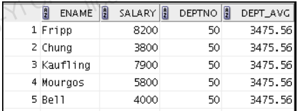

---
puppeteer:
   displayHeaderFooter: true
html: 
    embed_local_images: true
    embed_svg: true
export_on_save:
    html: true
---

#  WS2-L6 Retrieving Data using suqueries

## Exercises

### Q1
<!-- No.2 -->

Write a query to display the last name, department number, and salary of any employee whose department number and salary both match the department number and salary of any employee who earns a commission.

### Q2
<!-- No.6 -->

Write a query to find all employees who earn more than the average salary in their departments. 

Display the last name, salary, department ID, and the average salary for the department. Sort by average salary and round to two decimals. 

Use aliases for the columns retrieved by the query as shown in the sample output.

### Q3
<!-- No.7 -->

Find the last names of all employees who are not supervisors.
(a) Do this by using the `NOT EXISTS` operator.
(b) Do this by using the `NOT IN` operator.

### Q4
<!-- No.9 -->

Write a query to display the last names of the employees who have one or more coworkers in their departments with later hire dates but higher salaries.

### Q5
<!-- No.10 -->

Write a query to display the employee ID, last names, and department names of all the employees.

Need to use a scalar subquery to retrieve the department name in the SELECT statement.

### Q6
<!-- No.11 -->
Write a query to display the department names of those departments whose total salary cost is above one-eighth (1/8) of the total salary cost of the whole company. 

Use the `WITH` clause to write this query.

The column names in the report are `DEPARTMENT_NAME` and `DEPT_TOTAL`.

