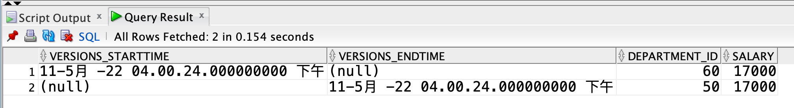

---
puppeteer:
   displayHeaderFooter: true
html: 
    embed_local_images: true
    embed_svg: true
export_on_save:
    html: true
---

#  WS2-L9 使用進階子查詢操作資料

## 題目

### Q1

先建立以下三個資料表：

```
create table sal_history (
    employee_id number(6),
    hire_date date, 
    salary number(8,2)
)

create table mgr_history (
    employee_id number(6),
    manager_id number(6),
    salary number(8,2)
)

create table special_sal (
    employee_id number(6),
    salary number(8,2)
)
```

撰寫查詢完成以下工作：
- 從 `employees` 資料表取得員工編號小於 125 的員工資料，欄位包括 `employee_id`、`hire_date`、`salary` 與 `manager_id`。
- 如果員工薪資大於 20,000，將該員工資料新增至 `special_sal` 資料表，欄位包括 `employee_id` 與 `salary`。
- 如果員工薪資小於 20,000：
  - 將該員工資料新增至 `sal_history` 資料表，欄位包括 `employee_id`、`hire_date`、`salary`。
  - 將該員工資料新增至 `mgr_history`，欄位包括 `employee_id` 與 `manager_id`。


### Q2 

執行以下程式建立 `sales_week_data` 資料表：

```
create table sales_week_data (
    id number(6),
    week_id number(2),
    qty_mon number(8,2),
    qty_tue number(8,2),
    qty_wed number(8,2),
    qty_thur number(8,2),
    qty_fri number(8,2),
)
```

使用以下程式將資料加入上述資料表：

```
insert into sales_week_data
    values (200, 6, 2050, 2200, 1700, 1200, 3000);
insert into sales_week_data
    values (210, 7, 2070, 2270, 1780, 1270, 3005);
```

執行以下程式建立 `emp_sales_info` 資料表：

```
create table emp_sales_info (
    id number(6),
    week number(2),
    qty_sales number(8,2)
)
```

請將 `sales_week_data` 資料表中的每一筆紀錄轉換後插入 `emp_sales_info` 資料表。提示：使用 pivoting `INSERT` 敘述。


### Q3 

建立 `bonuses` 資料表並新增以下資料：

```
create table bonuses ( employee_id number, bonus number default 100);

--- 有績效獎金的清單，預設獎金每人 100
insert into bonuses(employee_id)
select employee_id from employees where employee_id <= 110;
```

人力資源經理決定針對編號 100 到 120 的員工調整薪資。規則如下：
1. 薪資在 8000 美元以下或等於 8000 美元的員工應獲得獎金。
2. 沒有銷售紀錄的人（不在 `bonuses` 資料表中的員工）應獲得相當於其薪資 1% 的獎金。已有銷售紀錄的人（已存在於 `bonuses` 資料表中）則在現有獎金之外，再加發相當於其薪資 1% 的獎金。

請使用 `MERGE` 敘述完成上述需求。


### Q4 

建立 `emp2` 資料表

```
create table emp2 (
    id number(7),
    last_name varchar2(25),
    first_name varchar2(25),
    dept_id number(7)
)
```

1. 刪除（drop）`emp2` 資料表。
2. 查詢 recycle bin，確認此資料表是否出現在 recycle bin 中。
3. 將 `emp2` 資料表回復（restore）到 drop 前的狀態。


### Q5 

執行以下指令，建立 `emp3` 資料表並更新員工資料：
```
create table emp3 as 
select * from employees where department_id = 90;

update emp3 set department_id = 60 
where last_name = 'Kochhar';
commit;
update emp3 set department_id = 50 
where last_name = 'Kochhar';
commit;
```

請使用 Flashback versions query 查詢 `emp3` 中 `last_name` 為 `Kochhar` 之資料列在 `department_id` 欄位上的版本變化。




